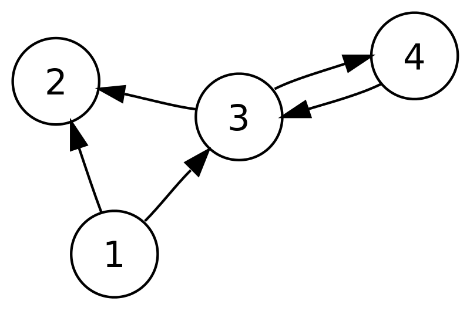

# Simple-Graph: A tutorial



This repo is designed to be a tutorial in how to build and use a graph library in Python with zero external library dependencies; we'll build the whole thing ourselves. This library focuses on graphs where the edges between nodes have directionality. This type of graph is known as a Directed Acyclic Graph, or a 'DAG'.

Please feel free to git clone this repo locally or just copy the code from the `src` files.

For visualization of the graph before and after applying algorithms that operate over it, we convert the graph into [dictim format](https://github.com/judepayne/dictim) (see wiki). Visualization is a handy way to understand the data representation that makes up the graph, but you don't need to know any detail behind dictim.

For Part1 (this part), we'll focus on graphs that have strictly hierarchical structures, i.e. trees and pre-order-traversal (prewalk) + post-order-traversal (postwalk) algorithms for editing those trees during a walk.

Part2 (documentation to come) will extend this to cover the traversal algorithms used for general purpose graphs (e.g. doesn't have to be a strict hierarchy).


## PART 1: Building a graph library and using for tree traversals


### Explanation of src files

#### `graph.py` <--- start here

Here we build our own graph library!

A natural way to express a graph is with the set of its nodes and edges. We'll let the user of this library to express a graph like this:

````python
{"nodes": [{"lei": "1234z", "name": "Guru Funds"},
           {"lei": "1235z", "name": "Binance"},
           {"lei": "1236z", "name": "Steadfast money"}],
 "edges": [{"src": "1234z", "dest": "1235z"},
           {"src": "1235z", "dest": "1236z", "color": "red"}]}
````

Each node is a dict, and each edge is a dict. There are just two conditions:

- All of the nodes must have one consistent key (in this case 'lei') that is unique. This is the `node_key`
- Each of the edges must have 'src' (source - the node that the edge is coming from) and 'dest' (destination node) keys.

Beyond this each node and each edge can have whatever other data you like, and it doesn't even need to be consistent. In this case though, all our nodes have a 'name' key and that's useful for visualization, for example.

Graphs are generally used for traversing over, so we need to convert the above specification of the graph into an internal format that is more optimized for that.


````python
{"nodemap": {'1234z':
	      {'out_edges':
	       {'1235z': [{'src': '1234z',
			   'dest': '1235z',
			   'id': '54f8128b-3ca6-409c-82d4-48c04f509a73'}]},
	       'in_edges': {}},
	      '1235z':
	      {'out_edges':
	       {'1236z': [{'src': '1235z',
			   'dest': '1236z',
			   'color': 'red',
			   'id': '2545a6f7-6052-45a4-92aa-9a82b3673705'}]},
	       'in_edges':
	       {'1234z': [{'src': '1234z',
			   'dest': '1235z',
			   'id': '54f8128b-3ca6-409c-82d4-48c04f509a73'}]}},
	      '1236z':
	      {'out_edges': {},
	       'in_edges':
	       {'1235z': [{'src': '1235z',
			   'dest': '1236z',
			   'id': '2545a6f7-6052-45a4-92aa-9a82b3673705'}]}}},
  "attrs": {"1234z":
	    {"lei": "1234z",
	     "name": "Guru Funds"},
	    "1235z":
	    {"lei": "1235z",
	     "name": "Binance"},
	    "1236z":
	    {"lei": "1236z",
	     "name": "Steadfast money"},
	    '54f8128b-3ca6-409c-82d4-48c04f509a73':
	    {'src': '1234z',
	     'dest': '1235z',
	     'id': '54f8128b-3ca6-409c-82d4-48c04f509a73'},
	    '2545a6f7-6052-45a4-92aa-9a82b3673705':
	    {'src': '1235z',
	     'dest': '1236z',
	     'color': 'red',
	     'id': '2545a6f7-6052-45a4-92aa-9a82b3673705'}}}
````

the `_init_graph` function does this conversion. edges are assigned guids during conversion since our graph will allow for more than one edge between the same `src` and `dest`, so we need a way to uniquely identify them.

Graph traversals move from node, through its `in_edges` or `out_edges` (depending on the direction of traversal) to the next node and so on. The `nodemap` part of the data structure is therefore optimized for traversal performance, at the cost of some data repetition.

The `attrs` key is where all other information about nodes and edges are kept. Our graph allows *arbitrarily rich data* to be added to nodes and edges. This makes it much more useful!


the `**Graph**` class is where all the heavy lifting is done. The code has been kept nice and simple; please have a read. I'll just call out a few methods of this class ...

#### ACCESS

- `nodes` -> returns a list of `node_key`s
- `edges` -> returns all edges
- `attrs` -> returns the attr dict for a specified node (by its `node_key`) or edge (by its `id`)
etc

#### MODIFICATION

- `add_node` -> adds a node to the graph
- `add_edge` -> adds an edge to the graph
- `remove_node` ->
etc

#### (Basic) TRAVERSAL and ANALYSIS

Here we get into more graph-specific functionality.

- `children` -> returns the child nodes of a given node
- `parents` -> the parents of a given node
- `roots` -> returns the set of nodes that have no parents themselves. A 'tree' (strict hierarchy) also has one root
- `leaves` -> returns the set of nodes that have no (further) child nodes
- `tree` -> returns True if the graph is a tree (please check the implementation)
etc

#### ALGORITHMS

- `topological_sort` -> returns the nodes ordered by their position in the dag i.e. roots first, leaves last
etc

Just a few starter algorithms are provided. There are many more. AI can help if you wish to add more algorithms.

#### UTILITY

utilities for printing or summarizing the graph

#### TREE WALKING

The main purpose of part 1 is to show how tree traversal works. Think of tree traversal like walking through a family tree or company hierarchy - you can visit nodes in different orders depending on your needs.


**Prewalking (Top-Down Processing)**: Start at the root node ('1'), visit it first, then move down to children ('7' and '9'), visit them, then continue down to their children, and so on. This is useful when you want to pass information DOWN the hierarchy (like a CEO announcing a policy change that flows down to all departments).

**Postwalking (Bottom-Up Processing)**: Start at the same root, but don't process nodes until you've visited ALL their children first. So you'd process the leaf nodes first, then work your way back up to the root. This is useful for aggregating information UP the hierarchy (like collecting budget reports from all departments to calculate the company total).

The `prewalk_attrs` and `postwalk_attrs` methods let you modify the graph as you traverse it, making them powerful tools for data transformation.

**Modification Functions**: Both prewalk and postwalk require you to supply a function that defines HOW to modify each node:

- **Prewalk function**: Takes `(parent_attrs, current_attrs)` and returns new attributes for the current node. The parent's data is available to influence the child.

- **Postwalk function**: Takes `(current_attrs, list_of_children_attrs)` and returns new attributes for the current node. All children's data is available to influence the parent.

**Example**: If you're calculating inheritance in a family tree, prewalk would pass wealth down from parents to children, while postwalk would count up all descendants and store that total in each ancestor.

See `demo.py` for practical examples of both approaches.


#### `data.py` & `dictim.py` <--- our next source files

I won't spend too much time here.

`data.py` holds a more complex tree `g1_prime` (which has 16 nodes). We'll use it for the demo.

`dictim.py` is for visualization, the details of which are interesting but not central to this tutorial. 'dictim' is a data format (that I invented) for describing how one should visualize a tree or graph. It can be expressed as json. The dictim command line tool then takes a piece of dictim and compiles it into another format called d2. The d2 command line tool can watch a .d2 file and show you the visualization live in your browser.

The `viz` in that file is worth covering though since we'll use it in the demo. It takes a graph and converts it into dictim which is written to 'hierarchy.json' each time it's called. If additionally 'path' arguments are provided, the data in the attrs map at that path is also visualized on the node.

As you get more familiar with the library, you might want to tweak the viz function further to add richness (e.g. conditional formatting of edges in the graph).


#### `demo.py` <--- Putting it all together

Here we go!

The file contains separate functions for each demo section. At the bottom, uncomment the function calls you want to run:

````python
if __name__ == "__main__":
    section_1()    # Create and visualize graph
    # section_2()  # Add color to root
    # section_3()  # Prewalk color down tree
````    

**Run the file** then have a look in `hierarchy.json`.

From the simple-graph directory, you can run with:

````bash
python -m src.demo
````

There are no dependencies between any of the sections, so the best way to run is to uncomment the one you want to run, leave the rest commented and run the file.


> [!NOTE]
> Before moving on to section 2, we must set up the live visualization..

##### Setting up command line tools for visualization

Two command line tools are required:

- **dictim** installation instructions [here](https://github.com/judepayne/dictim/wiki/Command-Line)
- **d2** installation instructions [here](https://github.com/terrastruct/d2?tab=readme-ov-file#install)

With a hierarchy.json in place, we first need to run dictim to read its contents and compile to a d2 file whenever it's rewritten.

The dictim tool uses d2 internally, as long as you're on a fairly recent version of dictim. Once both tools are installed, the simplest way to visualize the graph is to open a command prompt and run:

````bash
dictim -w hierarchy.json
````

and leave it running.

If you're not on a recent version of dictim, then you will need to run both dictim and d2 tools as follows...

From a command prompt, run:

````bash
dictim -c -w hierarchy.json -o hierarchy.d2
````

This will continuously compile hierarchy.json to hierarchy.d2

Now, in another command prompt, run:

````bash
d2 -w hierarchy.d2
````

This will (continuously) show you the visualization of the d2 in your browser.

When you first run it, you should see something like this:


We can leave these two commands running for the rest of the demo.


###### Just using the 


In brief, here's a summary of the different sections:

- section 1: visualize the graph
- section 2: add a 'color' attribute to the root node, and revisualize it
- section 3: prewalk the 'color' down the tree and revisualize it
- section 4: demonstrates conditional inheritance. We set MightyFunding's 'color' attribute to green and change the prewalk step fn to not override existing colors

You should be seeing this.


So far, we've used color to show inheritance/ conditional inheritance with prewalk as the mechanism to convey the inheritance. Let's switch to data.

- section 5: Adds a 'data' key to the attrs of both Fiscaledge (our root node) and MightyFunding. The 'client_relationship' key under these two indicate that these nodes are clients that our Sales teams wish to manage. Each client is then assigned a sector.
- section 6: demonstrates conditional inheritance of sector; if we hit a node which is a client (has a client_relationship) key, then we don't inherit sector down further.

You should be seeing this.


That's it for prewalking in this demo! Let's now move on to summarization using postwalking.


- section 7: adds some dummy 'revenue' data to the leaf nodes. We'll aggregate it in a few different ways to demonstrate the versatility of postwalk.

After running section 7, you should be seeing this.


- section 8: a simple '+' function to sum revenues up the hierarchy.


- section 9: just for fun, we'll take the hierarchy from section 8 and apply heatmap coloring.


- section 10: Another way to tally revenue up the tree. This time any client_relationship nodes 'win' the revenue that accrues to them, so while we sum up with '+' (in the revenue2 field), we also need an offsetting entry that propagates upwards (in the revenue2_offset field).


- section 11: Yet another way to tally revenue up the tree. Same answers as section 10, but without the need for offsets.


- section 12: Performance test - runs section 10's client offset aggregation logic 1000 times to benchmark the graph algorithm performance. Shows operations per second and average time per iteration.

I hope you enjoyed the first part of this tutorial!

### What you've learned

- that it's easy to construct your own graph library!
- prewalk and postwalk are powerful tools for working with hierarchies and trees. As higher-order functions (functions that accept other functions as parameters), they separate the traversal logic from the transformation logic. This separation makes it possible to explore multiple approaches to the same problem by simply changing the transformation function while keeping the traversal mechanism unchanged.

### golang port

The golang port of this project is available [here](https://github.com/judepayne/simple-graph-go)

## PART 2: Adding and using graph traversal algorithms

TODO!


License: MIT, copyright Jude Payne 2025
